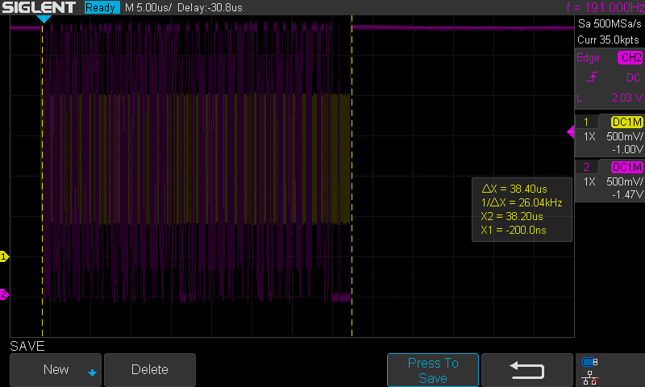
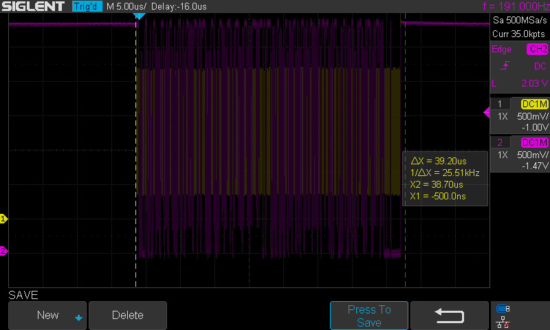
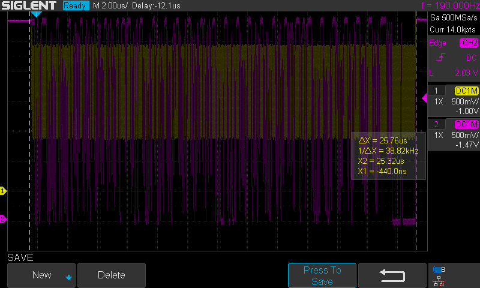
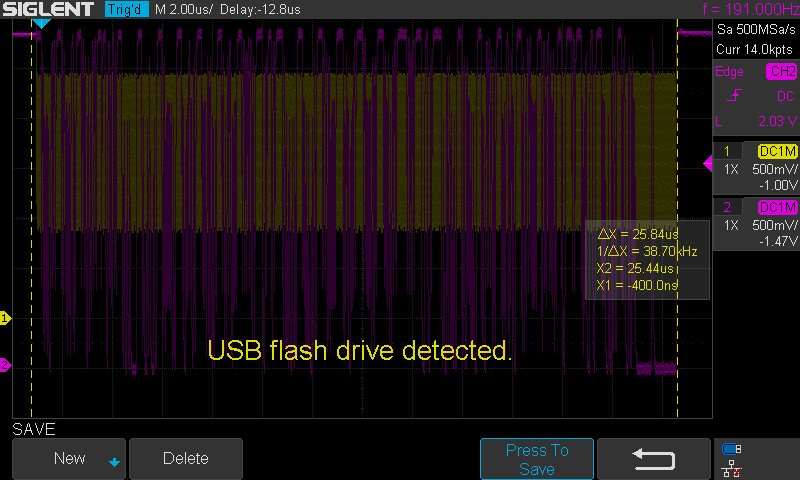
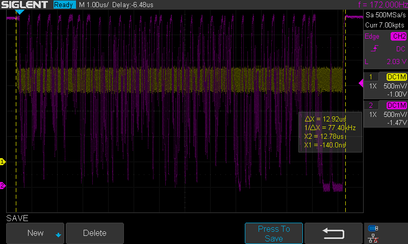

# Findings
| Clock Speed (Mhz) | Expected (μs) | Observed (μs) | Estimated Clock Speed (MHz) | Delta (μs) | Loop Time (μs) |
| ----------------- | ------------- | ------------- | --------------------------- | ---------- | -------------- |
| 25                | 43.50         | 38            | 30                          | 5.50       | 69             |
| 30                | 36.30         | 38            | 30                          | -1.70      | 69             |
| 35                | 31.10         | 25            | 45                          | 6.10       | 56             |
| 40                | 27.20         | 25            | 45                          | 2.20       | 56             |
| 100               | 10.88         | 13            | 85                          | -2.12      | 50             |

# Oscilliscope Readings:

Speed: 25 mhz, Sample: 69
Speed: 25 mhz, Sample: 69

# 30mhz

Speed: 30 mhz, Sample: 69
Speed: 30 mhz, Sample: 69

# 35mhz

Speed: 35 mhz, Sample: 56
Speed: 35 mhz, Sample: 56
Speed: 35 mhz, Sample: 56
Speed: 35 mhz, Sample: 56
Speed: 35 mhz, Sample: 56

# 40mhz

Speed: 40 mhz, Sample: 56
Speed: 40 mhz, Sample: 56
Speed: 40 mhz, Sample: 56
Speed: 40 mhz, Sample: 56
Speed: 40 mhz, Sample: 56

# 100mhz

Speed: 100 mhz, Sample: 50
Speed: 100 mhz, Sample: 50
Speed: 100 mhz, Sample: 50
Speed: 100 mhz, Sample: 50
Speed: 100 mhz, Sample: 50